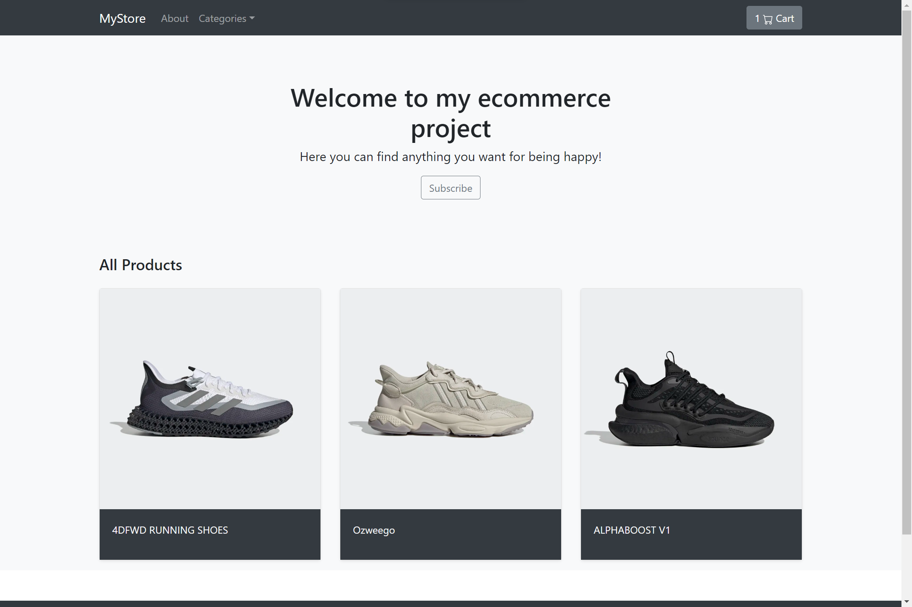
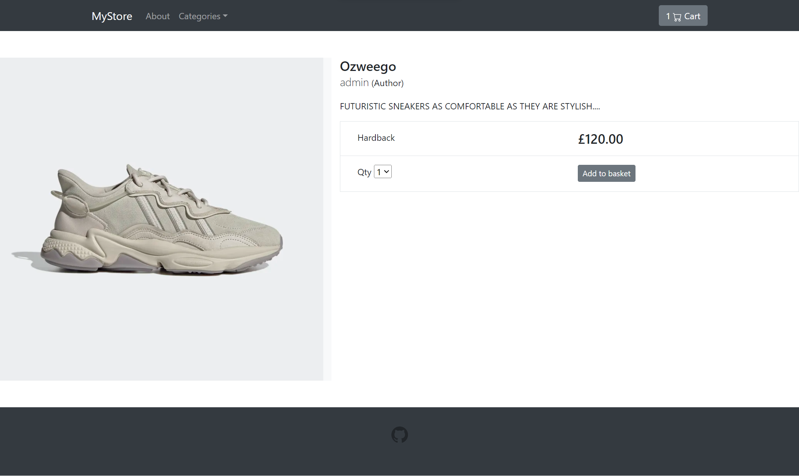
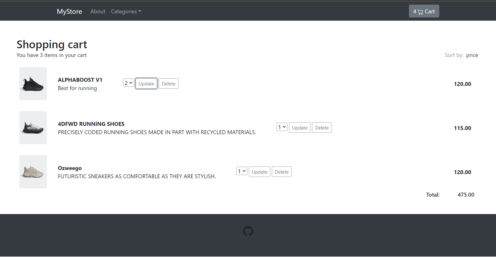

#Ecommerce Store Pet Project
This is an ecommerce store pet project built with Django, Python, HTML, CSS, AJAX and JavaScript.



## Features

- Product catalog 
- Shopping cart functionality
- Admin interface for managing products, orders, and users


  


## Setup

1. Clone the repository to your local machine.

2. Create a new virtual environment for the project using `virtualenv` or `venv`:

```shell
 python -m venv venv
 venv/bin/activate
```

3. Install the required packages using `pip`:
```shell
python -m pip install -r -requirement.txt
```

4. Create a new database using the following command:
```shell
python manage.py migrate
```

5. Load sample data into the database using the following command:
```shell
python manage.py loaddata db.json
```

6. Run the development server using the following command:
```shell
python manage.py runserver
```

7. Open your web browser and navigate to `http://localhost:8000` to access the application.

## Usage

- To browse products, click on the "Categories" link in the top navigation bar.
- To add a product to your shopping cart, click on the "Add to Cart" button on the product detail page.
- To view your shopping cart, click on the shopping cart icon in the top right corner of the page.
- To manage products, orders, and users, log in to the admin interface at `http://localhost:8000/admin`.

## Credits

This project was built by me, `Adam Rashi`. If you have any questions or feedback, please contact me at `adamrashi@mail.ru`.

